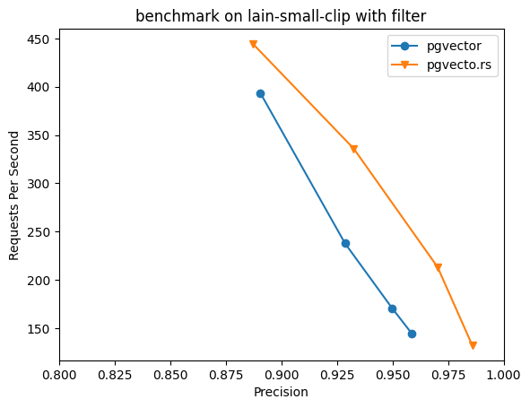

# Comparison with pgvector

## Delete and Transaction Support (Dead tuple problem)

In the HNSW index, the `ef_search` parameter controls the number of candidates returned by the index. However, pgvector may not provide sufficient results in cases where data is updated or deleted. This occurs because pgvector does not handle invisible tuples, which can arise when data has already been deleted or is part of an uncommitted transaction. Consequently, pgvector may fail to return the desired number of results specified by `ef_search`, resulting in poorer recall rates and potentially affecting application performance.

In contrast, pgvecto.rs resolves this problem by checking the tuple visibility in the traversal process and consistently returning the specified number of candidates. This makes pgvecto.rs fully supports the ACID transactions and allows users to utilize it in any scenario without sacrificing performance or incurring additional operational overhead.

We've conducted a straightforward [experiment](https://gist.github.com/VoVAllen/a83d2ee4b56a2a152019d768926f1a40) involving the insertion of 5000 vectors, followed by another 5000 vectors in an uncommitted transaction. When querying with `ef_search` set to 32, it was expected to return 32 results. However, pgvector only returned 17 results because it improperly skipped invisible tuples during traversal. Related issue can be found at https://github.com/pgvector/pgvector/issues/244

## Vector Dimension Limit

Another key advantage of pgvecto.rs over pgvector is its almost unlimited (65536) vector dimension support versus pgvector capping at 2000 dimensions. Pgvector limits the vector size to a maximum of 2000 dimensions. However, in order to achieve better results, it may occasionally exceed this limit. This also prevents us from conducting further tests with vector-db-benchmark on larger vectors, such as those with 2048 dimensions.

## Prefilter support

pgvecto.rs implements conditional filtering using a pre-filtering approach optimized for HNSW indexes. When a conditional filter is applied, a vector similarity search proceeds through the HNSW index to locate potential matching candidates based on the index topology. As candidates are identified, they are checked against the filter criteria by leveraging PostgreSQL's native indexing capabilities before being added to the result set. Only candidates that satisfy the filters are included. This allows pruning the raw HNSW results on-the-fly based on the specified filters. Candidates that don't meet the conditions are excluded without needing an explicit allow-list.

The search still adheres to the normal HNSW exit conditions, concluding when limits are hit and results no longer improve. By evaluating filters in real-time using PostgreSQL indexes during the HNSW traversal, pgvecto.rs combines the speed of approximate search with the precision of exact conditional logic.

Without pre-filtering support, pgvector's hnsw search with filtering is executed in the post-filtering pattern. This pattern returns a certain number of candidates and then applies the filter condition to them. However, it is difficult to determine how many candidates should be selected in the first step, which can lead to lower precision in the final results.

We did the experiments using laion dataset with vector-db-benchmark, and pgvecto.rs shows up to 2x speed up when precision > 90%, and higher precision, that pgvector cannot achieve due to the limit on hnsw's ef_search parameter. 

## Index build and persistence, and WAL amplification

pgvector:
- Utilize PostgreSQL's buffer and page storage for index storage.
- The index build process cannot be parallelized because hnsw is originally designed for memory usage. Inserting new points will result in significant changes to memory. Using postgres's pages will cause too many buffer locking and raising errors in postgres.
- There is also a WAL amplification issue for the same reason. When inserting 100k vectors with 100 dimensions. It will use 45mb as the data size and 279mb as the index size, but generates 1216mb write ahead logs, about 30x write amplification on the index
- The advantage of such implementation is that it seamlessly integrates with the postgres ecosystem, allowing for out-of-the-box compatibility with logical replication. However, it's important to note that pgvector's WAL amplification can also impact the logical replication process.

pgvecto.rs
- We initially attempted to use the page storage feature of PostgreSQL, but encountered issues with parallel build and WAL amplification mentioned above. As a result, we decided to utilize mmap for storing the index outside of PostgreSQL's storage system. We believe this approach will provide users with better experiences and allow us to iterate more quickly with various algorithms.
- pgvecto.rs doesn't have WAL amplification problem. When inserting 100k vectors with 100 dimensions, it will use 42mb as index's data size, and generates 42mb write ahead logs, less than 2x write amplification on the index.
- The drawback is that implementing logical replication in PostgreSQL requires additional effort. We have plans to implement it in the future.

Based on our testing of the `gist-960-euclidean` dataset on an 8-core, 32GB instance, with 1 million 960-dimensional vectors, it took 11,640 seconds to build the index using pgvector. pgvecto.rs only took 1,500 seconds, which is about 8x speedup. With larger machine, pgvecto.rs can further accelerate on by utilizing all cores whereas pgvector cannot.

## Performance

We opted for vector-db-benchmark over ann-benchmark because the latter is primarily intended for testing various algorithms rather than real-world database scenarios. Ann-benchmark only allows the algorithm to run on a single core and does not test throughput.

Our tests were conducted on an 8-core, 32GB instance. We had pgbouncer installed before a postgres instance, with separate installations of pgvector and pgvecto.rs. For this test, we used the official docker image of pgvector version 0.5.0.

Due to pgvector's vector size limit at 2000, we can only test on part of the dataset in vector-db-benchmark. And pgvecto.rs shows better results in both performance and speed comparing to pgvector, and up to 2x speed up when precision > 90%. Here's the results on gist-960-euclidean data, with m=16 and ef_construction=40 for both extensions.

